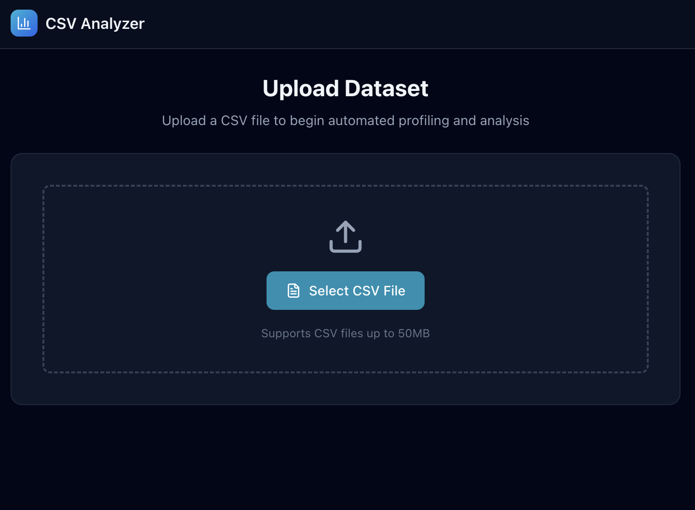
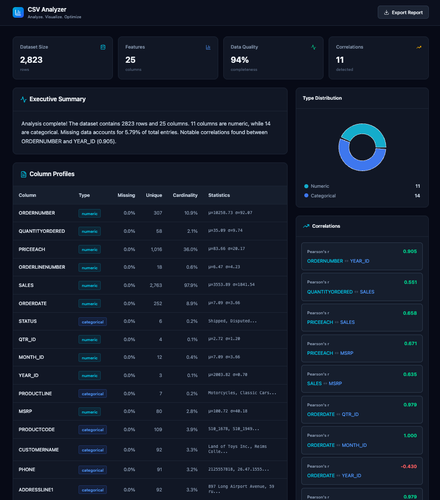
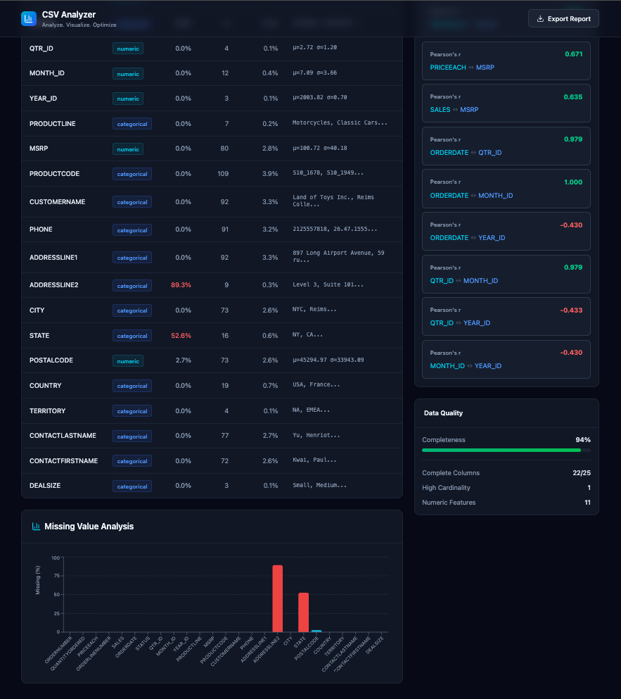
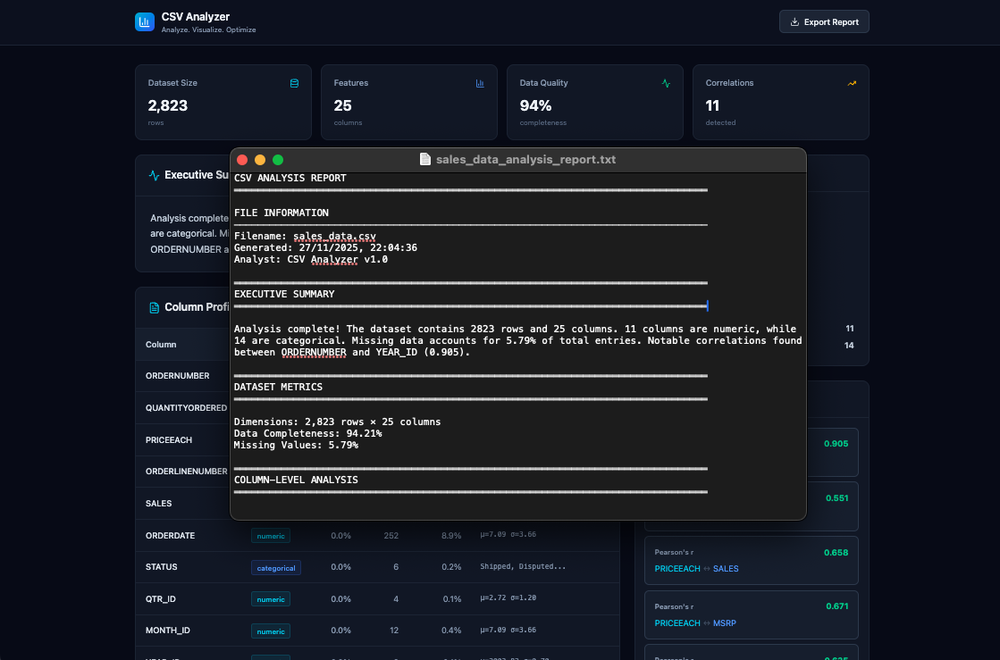

# CSV Summarizer

A powerful full-stack application for analyzing and summarizing CSV datasets. This tool provides automated statistical analysis, data visualization, and AI-powered insights.

## Features

- **Automated Analysis**: Instantly calculates statistics (mean, median, std dev, etc.) for numeric columns.
- **Data Visualization**: Interactive charts for missing values, type distribution, and correlations.
- **AI Summaries**: Generates concise, natural language summaries of your dataset using LLMs (Google Gemini).
- **Data Quality Assessment**: Evaluates completeness and identifies potential data quality issues.
- **Export Reports**: Download detailed analysis reports.

## Tech Stack

### Frontend
- **React**: UI library for building the interface.
- **Vite**: Fast build tool and development server.
- **Tailwind CSS**: Utility-first CSS framework for styling.
- **Recharts**: Composable charting library for React.
- **Lucide React**: Beautiful & consistent icons.
- **PapaParse**: Powerful CSV parser.

### Backend
- **Python**: Core logic for data processing.
- **FastAPI**: Lightweight backend server for API proxying.
- **Pandas**: Data manipulation and analysis.
- **Google Gemini API**: AI-powered insights and summaries.
- **Matplotlib/Seaborn**: Static image generation for charts.

## Getting Started

### Prerequisites
- Node.js (v16 or higher)
- Python (v3.8 or higher)
- npm or yarn

### Installation

1. **Clone the repository**
   ```bash
   git clone https://github.com/manasi582/csv_summarizer.git
   cd csv_summarizer
   ```

2. **Frontend Setup**
   ```bash
   cd frontend
   npm install
   ```

3. **Backend Setup** (Required for AI Summaries)
   ```bash
   cd ../backend
   python -m venv .venv
   source .venv/bin/activate  # On Windows: .venv\Scripts\activate
   pip install -r requirements.txt
   
   # Create a .env file in the root directory
   echo "GEMINI_API_KEY=your_api_key_here" > ../.env
   
   # Start the backend server
   uvicorn api:app --reload --port 8000
   ```

## Usage

1. **Start the Frontend**
   ```bash
   cd frontend
   npm run dev
   ```
   Open your browser and navigate to the URL shown (usually `http://localhost:5173`).

2. **Upload a CSV**
   - Click "Select CSV File" or drag and drop a file.
   - Wait for the analysis to complete.
   - Explore the dashboard and insights.

## Contributing
Feel free to submit a PR or open an issue for suggestions or bugs.

## License

This project is licensed under the MIT License.

## Screenshots

### Homepage


### CSV Summary Analysis




### Text File Generation

