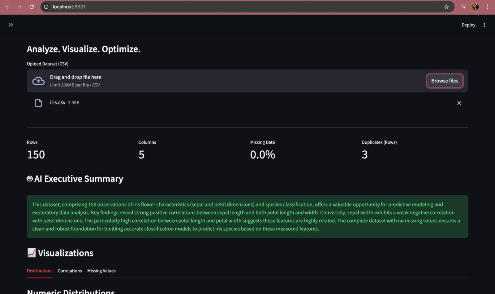
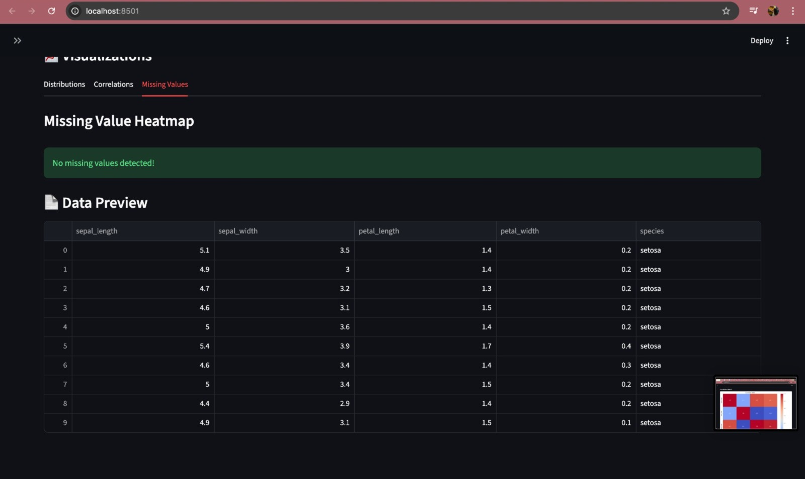
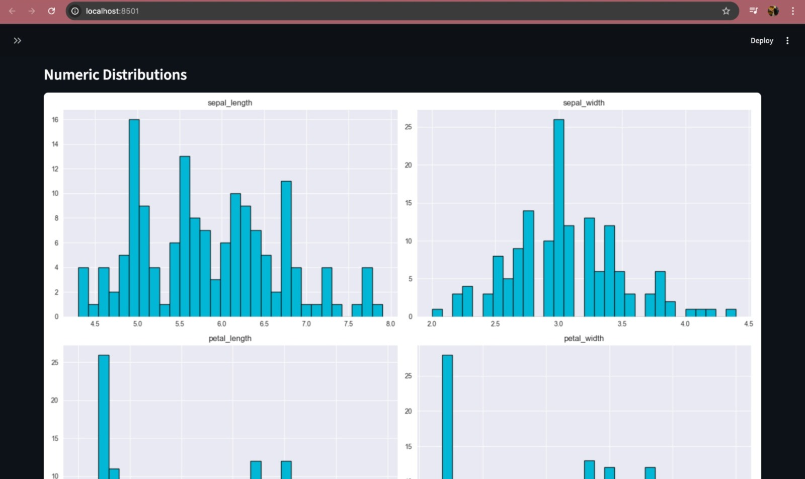
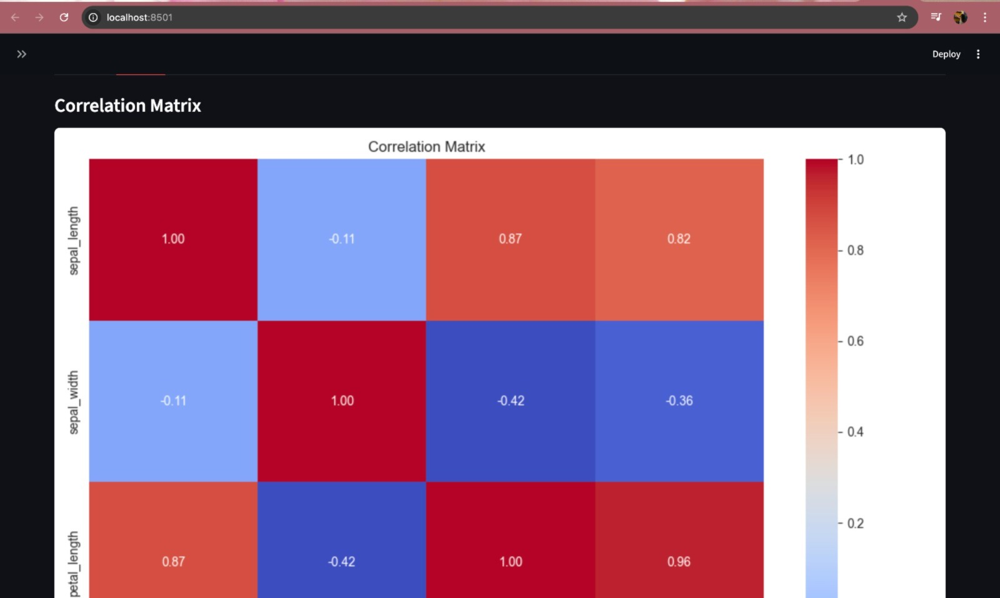

# CSV Summarizer

A powerful full-stack application for analyzing and summarizing CSV datasets. This tool provides automated statistical analysis, data visualization, and AI-powered insights.

## Features

- **Automated Analysis**: Instantly calculates statistics (mean, median, std dev, etc.) for numeric columns.
- **Data Visualization**: Interactive charts for missing values, type distribution, and correlations.
- **AI Summaries**: Generates concise, natural language summaries of your dataset using LLMs (Google Gemini).
- **Data Quality Assessment**: Evaluates completeness and identifies potential data quality issues.


### Tech Stack
- **Python**: The core language for everything.
- **Streamlit**: Turns data scripts into shareable web apps.
- **Pandas**: Data manipulation and analysis.
- **Google Gemini API**: AI-powered insights and summaries.
- **Matplotlib/Seaborn**: Static image generation for charts.

## Getting Started

### Prerequisites
- Python (v3.10 or higher)
- A Google Gemini API Key

### Installation

1. **Clone the repository**
   ```bash
   git clone https://github.com/manasi582/csv_summarizer.git
   cd csv_summarizer
   ```

2. **Setup Environment**
   ```bash
   python -m venv .venv
   source .venv/bin/activate  # On Windows: .venv\Scripts\activate
   pip install -r requirements.txt
   ```

3. **Configure API Key**
   Create a `.env` file in the root directory:
   ```bash
   echo "GEMINI_API_KEY=your_api_key_here" > .env
   ```

## Usage

1. **Run the App**
   ```bash
   streamlit run app.py
   ```
   
2. **Analysis**
   - Upload any CSV file.
   - The app will automatically generate profiling metrics, visualizations, and an AI summary.


## Contributing
Feel free to submit a PR or open an issue for suggestions or bugs.

## Screenshots

### AI Summary


### Data Preview


### Distributions


### Correlation Matrix


